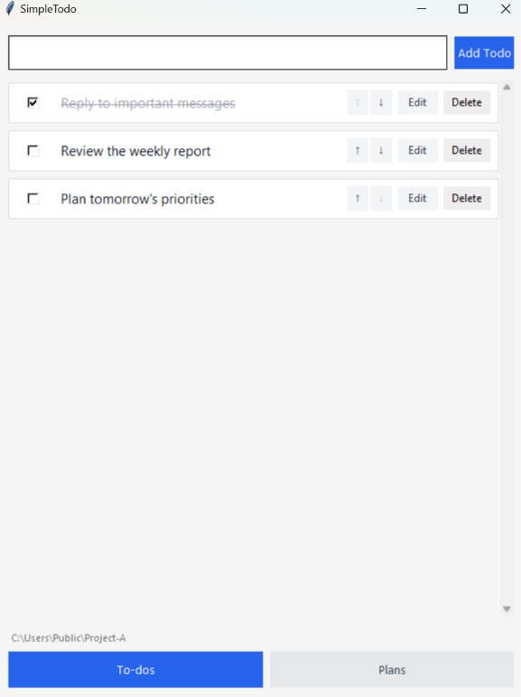

# SimpleTodo

SimpleTodo is a lightweight Windows desktop app for managing current tasks (**To-dos**) and future activities (**Plans**). Your data stays on your computer and is preserved when the app closes.



## One todo list per project folder

SimpleTodo can live inside each project folder. Place a copy of `SimpleTodo.exe` in every project you want to track, and each copy will keep its own `.simple_todos.json` data file beside the app.

```text
Project A/
├── SimpleTodo.exe
└── .simple_todos.json

Project B/
├── SimpleTodo.exe
└── .simple_todos.json
```

This keeps every project's tasks separate and makes it easy to see which todo list belongs to which folder.

## Install and run

SimpleTodo does not require a traditional installation or any third-party Python packages.

### 1. Install Python

If Python is not already installed:

1. Download Python 3 from the [official Python website](https://www.python.org/downloads/windows/).
2. Run the installer and select **Add python.exe to PATH**.
3. When installation finishes, open a new PowerShell window and verify it:

```powershell
python --version
```

If the command displays `Python 3.x.x`, you are ready to continue. An existing Miniconda or Anaconda Python 3 installation also works.

### 2. Download SimpleTodo

1. On this repository page, select **Code** → **Download ZIP**.
2. Extract the downloaded ZIP file.
3. Open the extracted `SimpleTodo-APP` folder.

Alternatively, download it with Git:

```powershell
git clone https://github.com/ZhangchengCharles/SimpleTodo-APP.git
cd SimpleTodo-APP
```

### 3. Start the app

Right-click an empty area inside the `SimpleTodo-APP` folder, select **Open in Terminal**, and run:

```powershell
python todo_app\todo_app.py
```

If your system uses the Python Launcher, you can run:

```powershell
py todo_app\todo_app.py
```

## Use the app

- **Switch lists:** Select **To-dos** or **Plans** at the bottom of the window.
- **Add an item:** Enter text at the top, then press `Enter` or select **Add Todo / Add Plan**.
- **Mark an item complete:** Select its checkbox. Select it again to mark the item incomplete.
- **Edit an item:** Select **Edit** or double-click the item text. Select **Save** or press `Ctrl+Enter` to save; press `Esc` to cancel.
- **Reorder items:** Select the `↑` or `↓` button beside an item.
- **Delete an item:** Select **Delete**. The item is removed immediately.

## Data and backups

Every change is automatically saved to `.simple_todos.json`:

- When running from Python, the file is stored in the folder where you started the command.
- When running the packaged app, the file is stored beside `SimpleTodo.exe`.

To back up or move your data, close SimpleTodo and copy `.simple_todos.json`.

## Build a Windows executable

To create a standalone `.exe`, install PyInstaller and use the included configuration:

```powershell
python -m pip install pyinstaller
pyinstaller SimpleTodo.spec
```

The executable is created at `dist\SimpleTodo.exe`.
